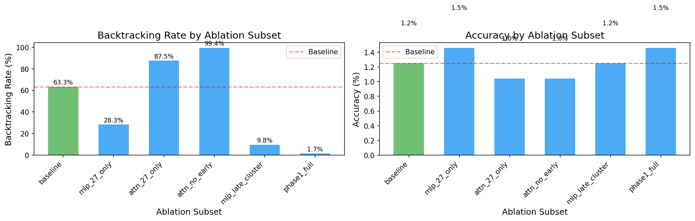

# Backtracking State Transition - Phase 2 Report

**Run ID:** `20251224_045331`
**Generated:** 2026-01-02 12:58:29
**Model:** `deepseek-ai/DeepSeek-R1-Distill-Qwen-1.5B`

---

## 1. Deconfounded Baseline Metrics

| Metric | Value |
|--------|-------|
| Total Samples (baseline only) | 3600 |
| Backtracking Rate | 68.1% |
| Overall Accuracy | 19.9% |
| Accuracy WITH Backtracking | 23.7% |
| Accuracy WITHOUT Backtracking | 11.5% |

**Accuracy Lift from Backtracking:** 2.06x

---

## 2. Subset Sweep Results

| Subset | Components | BT Rate | Accuracy |
|--------|------------|---------|----------|
| baseline | 0 | 63.3% | 1.2% |
| mlp_27_only | 1 | 28.3% | 1.5% |
| attn_27_only | 1 | 87.5% | 1.0% |
| attn_no_early | 4 | 99.4% | 1.0% |
| mlp_late_cluster | 6 | 9.8% | 1.2% |
| phase1_full | 12 | 1.7% | 1.5% |

---

## 3. Scale Sweep Results

| Scale | BT Rate | Accuracy |
|-------|---------|----------|
| 0.0 | 9.8% | 1.2% |
| 0.25 | 23.5% | 1.0% |
| 0.5 | 32.3% | 1.2% |
| 0.75 | 53.8% | 0.8% |
| 0.9 | 60.0% | 1.5% |

---

## 4. Continuation Ablation Analysis

Analyzed 450 measurements.

---

## 5. Conclusions

### Key Findings

1. **Deconfounded metrics** show baseline backtracking behavior without ablation artifacts.
2. **Subset sweep** identifies which layer combinations affect backtracking.
3. **Scale sweep** reveals the tradeoff curve between backtracking reduction and accuracy.
4. **Continuation analysis** measures the direct effect on onset token probability.

### Recommendations

- Use the subset with best BT reduction while retaining >50% accuracy
- Scale factors between 0.5-0.75 may offer a good tradeoff
- Further investigation into early attention layers (0-1) vs late MLP layers (19-27)
