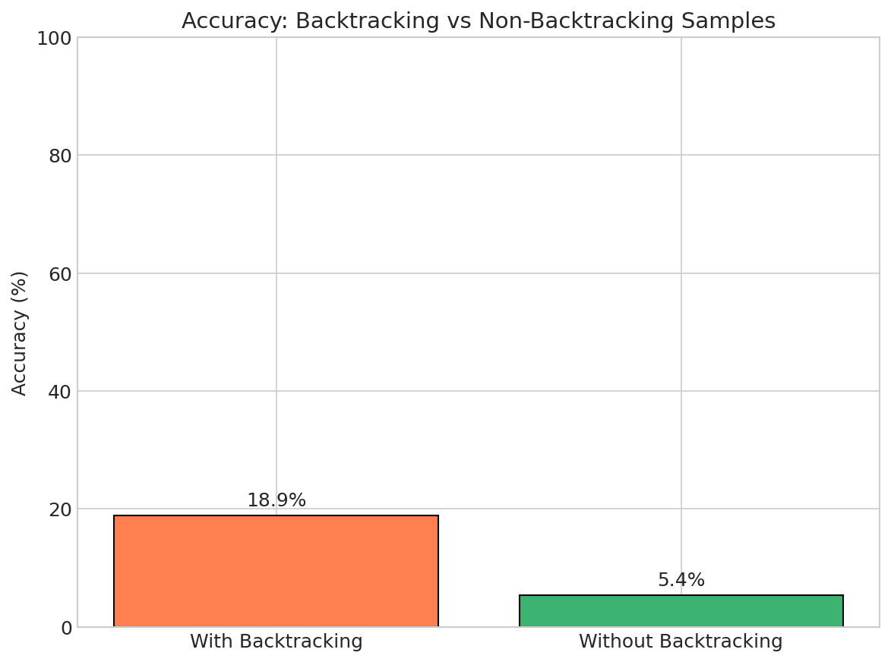
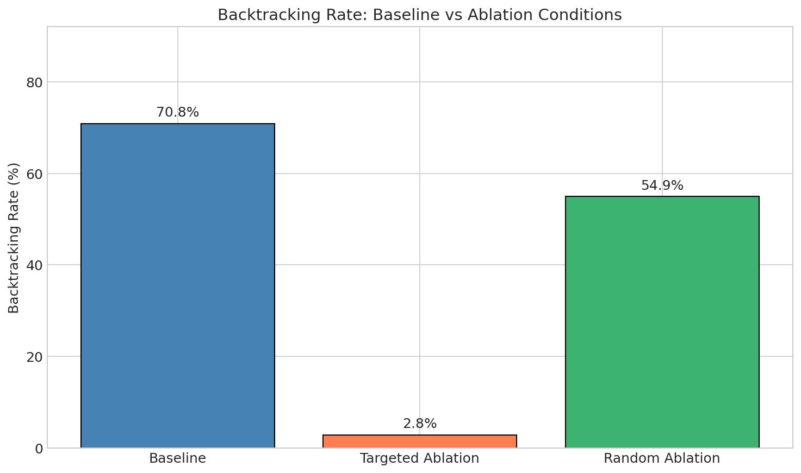

# Backtracking State Transition Experiment Report

**Run ID:** `20251223_232541`
**Generated:** 2025-12-24 03:47:45
**Model:** `deepseek-ai/DeepSeek-R1-Distill-Qwen-1.5B`
**Git SHA:** `82908c5f`

## Executive Summary

- **Backtracking Rate:** 52.4% of samples exhibit backtracking
- **Overall Accuracy:** 12.7%
- **Accuracy with Backtracking:** 18.9% (13.5% higher than without)

## Key Findings

- **Important Attention Layers:** [0, 27, 17, 1, 19, 15]
- **Important MLP Layers:** [27, 19, 23, 24, 20, 22]

## Figures

### Backtracking Rate by Formatting Variant


### Backtracking vs Accuracy Correlation


### Logit Lens: Target Token Evidence by Layer


### Ablation Importance by Layer


### Backtracking Rate: Baseline vs Ablation


### Formatting Effect on Backtracking


## Detailed Metrics

### Overall Statistics

| Metric | Value |
|--------|-------|
| Total Samples | 6000 |
| Backtracking (Strict) | 3145 (52.4%) |
| Backtracking (Relaxed) | 3182 (53.0%) |
| Correct | 747 |
| Incorrect | 5130 |

### By Formatting Variant

| Variant | Samples | BT Rate | Accuracy |
|---------|---------|---------|----------|
| baseline_think_newline | 3600 | 42.9% | 8.1% |
| think_same_line | 1200 | 68.2% | 19.7% |
| no_think_tags | 1200 | 65.3% | 18.2% |

### By Condition

| Condition | Samples | BT Rate | Accuracy |
|-----------|---------|---------|----------|
| baseline | 3600 | 68.1% | 19.8% |
| targeted_ablation | 1200 | 2.8% | 1.2% |
| random_ablation | 1200 | 54.9% | 1.6% |

## Selected Layers for Ablation

These layers showed the strongest causal effect on backtracking trigger production:

```json
{
  "attn": [
    0,
    27,
    17,
    1,
    19,
    15
  ],
  "mlp": [
    27,
    19,
    23,
    24,
    20,
    22
  ]
}
```

## Methodology

1. **Baseline Generation:** Generated multiple samples per problem with standard sampling
2. **Backtracking Detection:** Identified samples containing trigger phrases (Wait, Actually, Hold on)
3. **Logit Lens Analysis:** Computed target token logit at each layer for backtracking vs position-matched controls
4. **Ablation Scan:** Tested causal importance of each layer by ablating attention/MLP outputs
5. **Generation Ablation:** Compared backtracking rates with targeted vs random layer ablation

## Caveats and Limitations

- Results are specific to the model and dataset used
- Backtracking detection relies on keyword matching, which may miss some instances
- Ablation effects may interact non-linearly across layers
- Position-matched controls help but don't perfectly isolate backtracking-specific effects

## Artifacts

### Analysis Files
- `runs/20251223_232541/analysis/backtracking_events.csv`
- `runs/20251223_232541/analysis/summary_metrics.json`
- `runs/20251223_232541/analysis/logit_lens.csv`
- `runs/20251223_232541/analysis/ablation_importance.csv`
- `runs/20251223_232541/analysis/selected_layers.json`

### Figures
- `figures/backtracking_rate_by_variant.png`
- `figures/backtracking_vs_accuracy.png`
- `figures/wait_logit_lens_bt_vs_control.png`
- `figures/ablation_importance_by_layer.png`
- `figures/backtracking_rate_by_condition.png`
- `figures/formatting_effect_on_backtracking.png`
